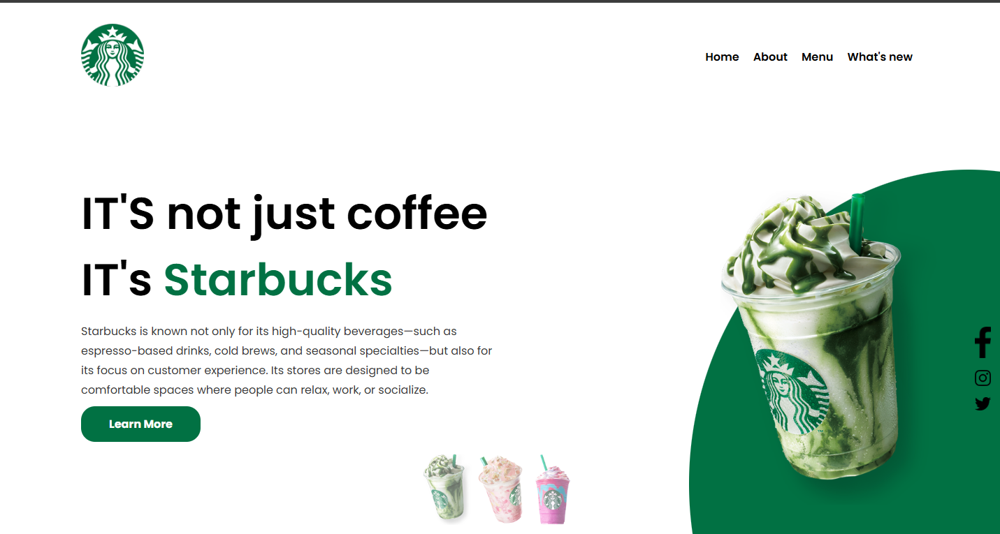

# ☕ Starbucks Clone

<p align="center">
  
</p>

<p align="center">
  
  
  
</p>

<p align="center">
  Projeto clone da landing page da Starbucks, desenvolvido com HTML5, CSS3 e JavaScript puro.
</p>


## 🖥️ Preview



---

## 📋 Sobre o Projeto

Este projeto é um clone da landing page da **Starbucks**, desenvolvido durante os estudos na **[Danki Code](https://cursos.dankicode.com/)**, onde tive o máximo de aprendizado na prática.

O objetivo foi reproduzir uma interface moderna e responsiva, aplicando os conhecimentos de HTML5, CSS3 e JavaScript, focando em boas práticas de desenvolvimento front-end.

---

## ✨ Funcionalidades

- ✅ Layout responsivo (Desktop e Mobile)
- ✅ Menu hamburguer para dispositivos móveis
- ✅ Troca de imagem do drink ao clicar nos thumbnails
- ✅ Efeito de thumb ativo com highlight visual
- ✅ Animações e transições em CSS
- ✅ Navegação suave e intuitiva

---

## 🖥️ Preview

| Desktop | Mobile |
|---|---|
| Layout completo com drink em destaque | Menu hamburguer + imagem responsiva |

---

## 🚀 Tecnologias Utilizadas

| Tecnologia | Descrição |
|---|---|
| **HTML5** | Estrutura semântica da página |
| **CSS3** | Estilização, responsividade e animações |
| **JavaScript** | Interatividade, troca de imagens e menu mobile |

---

## 📁 Estrutura do Projeto

```
starbucks-clone/
│
├── assets/
│   ├── css/
│   │   ├── style.css
│   │   ├── resete.css
│   │   ├── frame.css
│   │   ├── media.css
│   │   └── color.css
│   │
│   ├── img/
│   │   ├── logo.png
│   │   ├── img1.png
│   │   ├── img2.png
│   │   ├── img3.png
│   │   ├── thumb1.png
│   │   ├── thumb2.png
│   │   └── thumb3.png
│   │
│   └── js/
│       ├── menu.js
│       └── function.js
│
└── index.html
```

---

## 💡 O que aprendi

- Estruturação semântica com **HTML5**
- Criação de layouts com **Flexbox**
- **Responsividade** com Media Queries
- Manipulação do **DOM** com JavaScript
- Uso de **variáveis CSS** (Custom Properties)
- Boas práticas de organização de arquivos e pastas
- Trabalhar com **posicionamento absoluto e relativo**
- Criar efeitos visuais com **transições CSS**

---

## 🎓 Desenvolvido com

Este projeto foi desenvolvido durante os cursos da **[Danki Code](https://cursos.dankicode.com/)**, uma das maiores plataformas de ensino de programação do Brasil, onde tive o máximo de aprendizado e evolução como desenvolvedor front-end.

---

## 👨‍💻 Autor

Feito com ☕ e muito código.

⭐ Se este projeto te ajudou de alguma forma, deixa uma estrela no repositório!
